# System Design: Knowledge Support Copilot

> **Purpose:** Production-ready RAG architecture for source-backed support answers, safe fallback, and a clear path from local MVP to cloud scale.

**Related docs:** [problem-framing.md](problem-framing.md) · [founder-brief.md](founder-brief.md)

---

## Table of Contents

| # | Section |
|---|---------|
| 1 | [Executive Summary](#1-executive-summary) |
| 2 | [Design Goals](#2-design-goals) |
| 3 | [Non-Goals (Phase 1)](#3-non-goals-phase-1) |
| 4 | [High-Level Architecture](#4-high-level-architecture) |
| 5 | [Core Components](#5-core-components) |
| 6 | [End-to-End Request Flow](#6-end-to-end-request-flow) |
| 7 | [Data Design](#7-data-design-simple-view) |
| 8 | [API Contract (MVP)](#8-api-contract-mvp) |
| 9 | [Security, Trust, and Compliance](#9-security-trust-and-compliance) |
| 10 | [Reliability and SLOs](#10-reliability-and-slos) |
| 11 | [Performance and Scaling Strategy](#11-performance-and-scaling-strategy) |
| 12 | [Quality Evaluation Framework](#12-quality-evaluation-framework) |
| 13 | [Rollout Plan](#13-rollout-plan) |
| 14 | [Open Decisions Checklist](#14-open-decisions-checklist) |
| 15 | [Final Design Statement](#15-final-design-statement) |

---

## 1) Executive Summary

Knowledge Support Copilot is a production-ready Retrieval-Augmented Generation (RAG) system that answers customer and internal support questions using approved company knowledge.  
It is designed to be:

- **Simple to start locally**
- **Reliable and safe in production**
- **Understandable for both technical and non-technical teams**

The system retrieves relevant source content before generating an answer, always returns citations, and falls back to human support when confidence is low.

### System at a Glance

> Diagrams use **draw.io–style blocks**: swimlane groups, rectangular shapes, and color-coded roles.

| Color | Meaning |
|-------|---------|
| Green | Users / inputs |
| Blue | Services / processing |
| Yellow | Data stores / outputs |
| Purple | Decisions / safety gates |
| Orange | Observability / side paths |
| Gray border | Swimlane group (like draw.io container) |

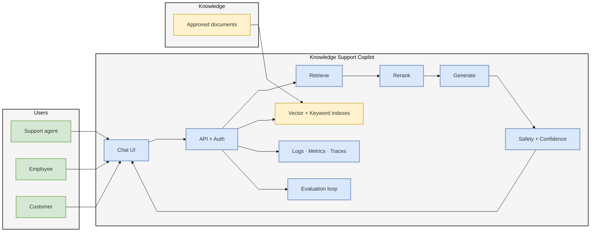

---

## 2) Design Goals

### Business Goals

- Reduce repeated support workload
- Improve response speed and consistency
- Increase trust with source-backed answers
- Enable safe escalation when the assistant is unsure

### Technical Goals

- Local-first implementation with clear cloud migration path
- Modular architecture (swap model, vector DB, UI without full rewrite)
- Measurable quality through retrieval and answer evaluation
- Production controls for security, observability, and reliability

---

## 3) Non-Goals (Phase 1)

- Autonomous high-risk actions (refunds, account updates, write operations)
- Broad open-web answering without governance
- Complex multi-agent orchestration
- Full multimodal pipelines (image/table-heavy reasoning) in initial release

---

## 4) High-Level Architecture

The architecture is organized into six practical layers so teams can build a simple MVP now and scale safely later.

### Architecture Overview (Six Layers)

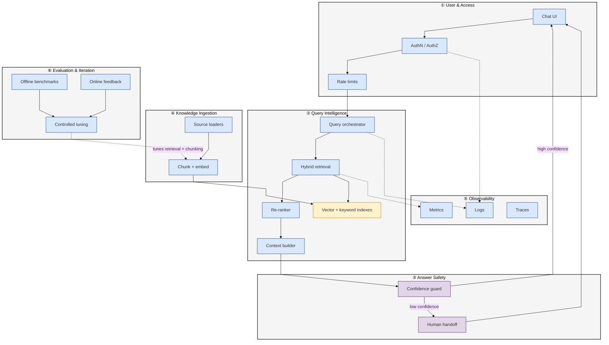

| Layer | Responsibility | MVP focus |
|-------|----------------|-----------|
| User & Access | Who can ask what | API + role-based source scope |
| Query Intelligence | Find and rank evidence | Hybrid search + rerank |
| Answer Safety | No guessing when unsure | Confidence threshold + escalation |
| Knowledge Ingestion | Fresh, searchable content | Scheduled batch ingest |
| Observability | Operate and debug | Structured logs + core metrics |
| Evaluation | Improve over time | Offline set + user feedback |

---

### 4.1 User and Access Layer

Users interact through a chat interface. Every request first goes through the backend API and access control checks.  
This layer ensures only authorized users can query approved knowledge sources.

### 4.2 Query Intelligence Layer

After authentication, a query orchestrator controls the response pipeline:

- query understanding/preprocessing
- hybrid retrieval (semantic + keyword)
- re-ranking of candidate passages
- context assembly for LLM generation

This layer is responsible for answer quality and relevance.

### 4.3 Answer Safety Layer

Generated output is passed through a safety and confidence guard before it is shown to the user.

- If confidence is acceptable, the system returns an answer with citations.
- If confidence is low, the system avoids guessing and routes to human handoff.

This prevents unsafe or unsupported responses.

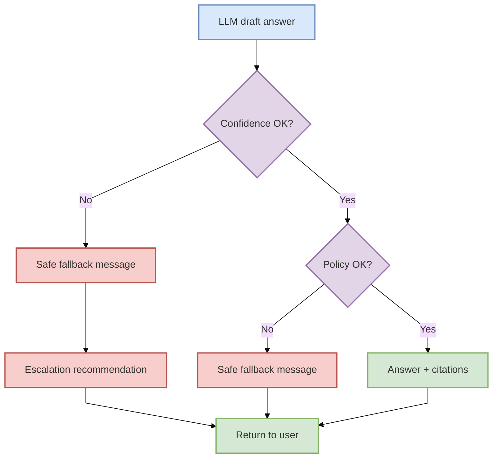

### 4.4 Knowledge Ingestion Layer

Approved documents (FAQs, policies, manuals, support docs) are ingested, chunked, embedded, and indexed.

- MVP: simple scheduled ingestion and single-index storage
- Future scale (not MVP): queue-based ingestion, parallel worker pools, shard-ready indexing for approximately 10,000 to 100,000 documents

This layer controls freshness and retrieval performance.

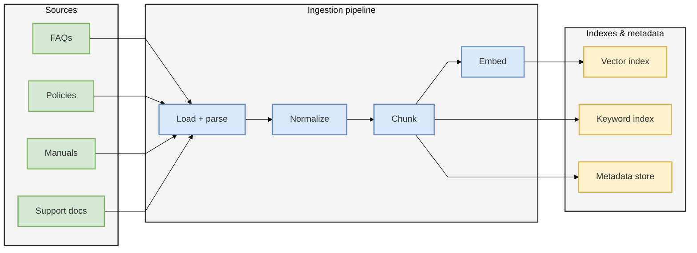

### 4.5 Observability and Alerting Layer

All critical components emit logs, metrics, and traces.

- logs for request/response and handoff events
- metrics for latency, failures, confidence distribution, and retrieval quality
- traces for debugging bottlenecks across services
- alerting for threshold breaches and dependency failures

This layer enables operational reliability and faster incident response.

### 4.6 Evaluation and Iteration Layer

The system includes a continuous improvement loop:

- offline evaluation with benchmark question sets
- online evaluation from user feedback and escalation signals
- failure mode analysis (hallucination, weak retrieval, timeout, stale content)
- controlled tuning and release cycle (prompt, retrieval, threshold updates)

This layer ensures measurable quality improvement over time.

### 4.7 Failure Handling Strategy

Failure handling is applied across layers with clear controls:

- timeout policies for slow dependencies
- retry with backoff for transient failures
- circuit breaker for unstable downstream services
- dead-letter handling for failed ingestion jobs
- safe fallback message when final answer cannot be trusted

These controls reduce outage impact and protect user trust.

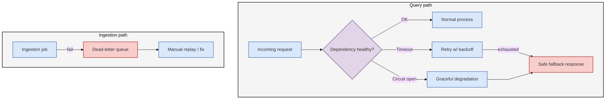

### 4.8 Step-by-Step Implementation Flow

Build features in this order so dependencies are stable and testable at each stage.

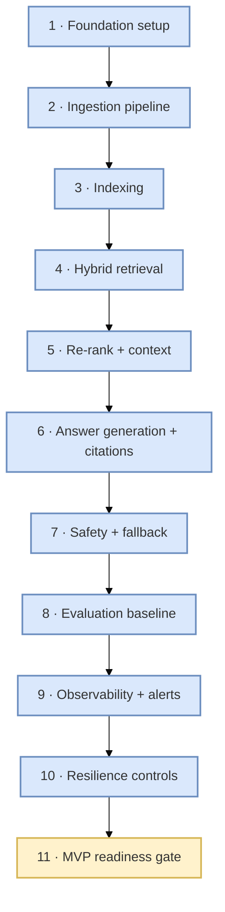

1. **Foundation setup**  
   Create base project structure, environment config, secret management, health endpoint, and structured logging.

2. **Ingestion pipeline**  
   Implement source loaders, parsing, normalization, chunking, and metadata mapping.

3. **Indexing pipeline**  
   Generate embeddings, build vector and keyword indexes, and validate index consistency.

4. **Hybrid retrieval**  
   Add vector retrieval, keyword retrieval, rank fusion, and top-k candidate controls.

5. **Re-ranking and context build**  
   Re-rank merged candidates, select final chunks, and prepare context within token budget.

6. **Answer generation and citations**  
   Integrate LLM provider routing, generate grounded answers, and return citation-rich responses.

7. **Safety and fallback**  
   Add confidence thresholds, policy checks, and escalation behavior for low-confidence outputs.

8. **Evaluation baseline**  
   Run offline benchmark metrics (Recall@k, Precision@k, groundedness, citation quality) and capture starting scores.

9. **Observability and alerts**  
   Add metrics, traces, and alert rules for latency, failure spikes, fallback spikes, and ingestion backlog.

10. **Resilience controls**  
    Finalize timeout, retry with backoff, circuit breaker, and dead-letter queue handling.

11. **MVP readiness gate**  
    Approve release only if citation coverage, fallback behavior, and latency reporting meet defined targets.

### 4.9 Runtime Request Flow (Execution Path)

Use this runtime flow to verify implementation correctness during code reviews and testing.

```mermaid
%%{init: {'flowchart': {'curve': 'linear', 'padding': 16}, 'theme': 'base'}}%%
flowchart LR
  classDef userBox fill:#d5e8d4,stroke:#82b366,stroke-width:2px,color:#333
  classDef svcBox fill:#dae8fc,stroke:#6c8ebf,stroke-width:2px,color:#333
  classDef obsBox fill:#ffe6cc,stroke:#d79b00,stroke-width:2px,color:#333
  classDef altBox fill:#e1d5e7,stroke:#9673a6,stroke-width:2px,color:#333

  subgraph lane_user ["User"]
    u1["① Submit question"]
    u2["⑫ View response"]
  end

  subgraph lane_ui ["Chat UI"]
    ui1["② Forward request"]
    ui2["⑪ Display response"]
  end

  subgraph lane_api ["API / Backend"]
    api1["③ Validate auth + scope"]
    api2["④ Route to orchestrator"]
    api3["⑬ Emit logs / metrics / traces"]
  end

  subgraph lane_orch ["Query orchestrator"]
    o1["⑤ Preprocess query"]
  end

  subgraph lane_ret ["Hybrid retriever"]
    r1["⑥ Vector + keyword search"]
    r2["⑦ Candidate chunks"]
  end

  subgraph lane_rank ["Re-ranker → Context"]
    rk1["⑧ Top evidence set"]
    rk2["⑨ Grounded prompt"]
  end

  subgraph lane_llm ["LLM + Safety"]
    l1["⑩ Draft answer + citations"]
    l2{"Confidence + policy OK?"}
    l3["⑪a Answer + citations"]
    l4["⑪b Fallback + escalation"]
  end

  u1 --> ui1 --> api1 --> api2 --> o1 --> r1 --> r2 --> rk1 --> rk2 --> l1 --> l2
  l2 -->|Yes| l3 --> ui2 --> u2
  l2 -->|No| l4 --> ui2
  api2 -.-> api3

  class u1,u2 userBox
  class ui1,ui2,api1,api2,o1,r1,r2,rk1,rk2,l1,l3,l4 svcBox
  class l2 altBox
  class api3 obsBox
  style lane_user fill:#f5f5f5,stroke:#333,stroke-width:2px
  style lane_ui fill:#f5f5f5,stroke:#333,stroke-width:2px
  style lane_api fill:#f5f5f5,stroke:#333,stroke-width:2px
  style lane_orch fill:#f5f5f5,stroke:#333,stroke-width:2px
  style lane_ret fill:#f5f5f5,stroke:#333,stroke-width:2px
  style lane_rank fill:#f5f5f5,stroke:#333,stroke-width:2px
  style lane_llm fill:#f5f5f5,stroke:#333,stroke-width:2px
```

1. User submits query from chat UI.
2. API validates request, identity, and access scope.
3. Query orchestrator preprocesses and routes request.
4. Hybrid retriever fetches vector and keyword candidates.
5. Re-ranker selects the most relevant evidence set.
6. Context builder assembles final prompt context.
7. LLM generates answer constrained by retrieved evidence.
8. Safety layer checks confidence and policy compliance.
9. System returns either:
   - grounded answer with citations, or
   - safe fallback and escalation recommendation.
10. Observability pipeline records logs, metrics, traces, and evaluation signals.

### 4.10 Flow Validation Checklist

Use this checklist to confirm the end-to-end flow is implemented correctly.

- **Access control check:** unauthorized users are blocked before retrieval.
- **Retrieval correctness check:** for known benchmark queries, top-k results include expected relevant chunks.
- **Citation integrity check:** each answer contains valid source references (`doc_id/chunk_id` or equivalent).
- **Fallback behavior check:** low-confidence queries do not produce speculative answers and return safe fallback.
- **Escalation path check:** fallback responses include actionable human handoff guidance.
- **Latency check:** p95 request latency is captured and compared to target.
- **Failure resilience check:** timeout/retry/circuit-breaker behavior works for simulated provider outages.
- **Ingestion reliability check:** failed ingestion jobs are sent to DLQ with complete error payload and replay option.
- **Observability check:** logs, metrics, and traces are emitted for every query path.
- **Evaluation continuity check:** offline and online evaluation metrics are produced and reviewed on schedule.

---

## 5) Core Components

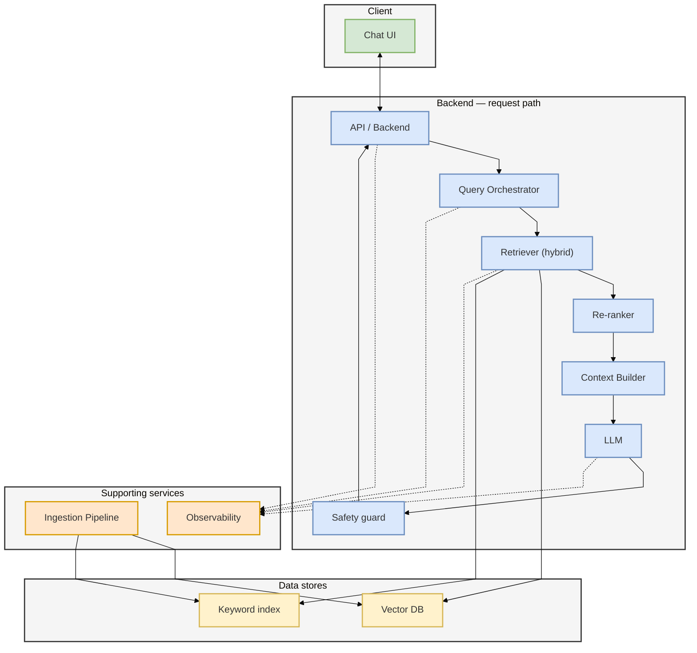

### 5.1 Chat UI

- Simple interface for asking questions and viewing citations
- Shows answer confidence state: high, medium, low
- Provides "escalate to human" action when needed

### 5.2 API / Backend Service

- Entry point for all user requests
- Handles authentication, authorization, rate limits, and request validation
- Sends request through orchestrator and returns structured response

### 5.3 Query Orchestrator

- Central workflow manager for each question
- Executes steps: preprocess -> retrieve -> rerank -> generate -> validate
- Enforces guardrails and timeout policies

### 5.4 Retriever (Hybrid Search)

- Uses semantic retrieval from vector DB
- Uses keyword/BM25 retrieval from keyword index
- Merges and ranks candidates for better recall and precision

### 5.5 Re-ranker

- Improves ranking quality for final context selection
- Promotes passages most relevant to user intent

### 5.6 Context Builder

- Selects top passages under token budget
- Adds metadata (source, title, section, last updated)
- Creates LLM-ready grounded prompt context

### 5.7 LLM Inference

- Generates final response using retrieved evidence only
- Outputs concise answer with references
- Avoids unsupported claims by instruction design

### 5.8 Safety and Confidence Guard

- Checks evidence strength and answer groundedness
- Applies policy checks (sensitive topics, unsafe outputs)
- Triggers fallback response and escalation when confidence is low

### 5.9 Ingestion Pipeline

- Collects approved documents from controlled sources
- Splits content into chunks and creates embeddings
- Stores chunks + metadata in search stores
- Supports scheduled re-indexing for freshness

### 5.10 Observability Layer

- Central logs for requests, retrieval, generation, and handoffs
- Metrics dashboards for quality, latency, and usage
- Tracing to debug slow or failed requests

---

## 6) End-to-End Request Flow

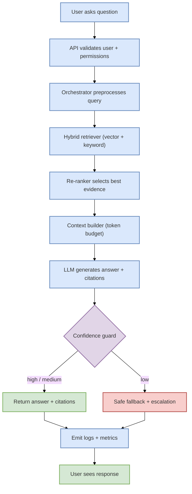

1. User submits a question in chat UI  
2. API validates user and permissions  
3. Orchestrator reformulates query if needed  
4. Retriever fetches candidates from vector + keyword indexes  
5. Re-ranker selects best evidence  
6. Context builder prepares source-limited prompt  
7. LLM generates answer with citations  
8. Safety/confidence guard validates output  
9. If confidence is low, system returns safe fallback and escalation path  
10. Logs/metrics are emitted for monitoring and improvement

---

## 7) Data Design (Simple View)

### 7.1 Document Metadata (per chunk)

- `doc_id`
- `chunk_id`
- `source_type` (FAQ, policy, manual, ticket note)
- `title`
- `section`
- `content`
- `embedding_vector`
- `updated_at`
- `owner_team`
- `access_scope`

### 7.2 Query/Answer Audit Record

- `request_id`
- `timestamp`
- `user_role`
- `question`
- `retrieved_chunk_ids`
- `answer_text`
- `citations`
- `confidence_score`
- `fallback_triggered`
- `escalated`
- `latency_ms`

### 7.3 Data Model (Relationships)

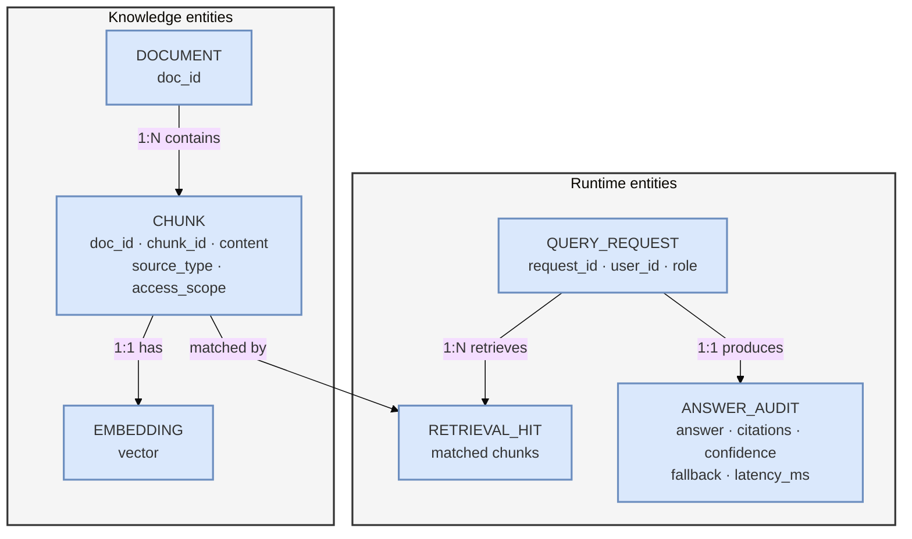

---

## 8) API Contract (MVP)

```mermaid
%%{init: {'flowchart': {'curve': 'linear', 'padding': 16}, 'theme': 'base'}}%%
flowchart TB
  classDef clientBox fill:#d5e8d4,stroke:#82b366,stroke-width:2px,color:#333
  classDef apiBox fill:#dae8fc,stroke:#6c8ebf,stroke-width:2px,color:#333
  classDef ragBox fill:#fff2cc,stroke:#d6b656,stroke-width:2px,color:#333
  classDef storeBox fill:#ffe6cc,stroke:#d79b00,stroke-width:2px,color:#333

  subgraph queryFlow ["POST /v1/query"]
    direction LR
    C1["Client"] -->|question, user_id, role| A1["API"]
    A1 -->|authorized query| R1["RAG pipeline"]
    R1 -->|answer, citations, confidence| A2["API"]
    A2 -->|response + request_id| C2["Client"]
  end

  subgraph feedbackFlow ["POST /v1/feedback (optional)"]
    direction LR
    C3["Client"] -->|request_id, rating| A3["API"]
    A3 -->|store| E1["Evaluation dataset"]
  end

  class C1,C2,C3 clientBox
  class A1,A2,A3 apiBox
  class R1 ragBox
  class E1 storeBox
  style queryFlow fill:#f5f5f5,stroke:#333,stroke-width:2px
  style feedbackFlow fill:#f5f5f5,stroke:#333,stroke-width:2px
```

### `POST /v1/query`

Request:

- `question`
- `user_id`
- `user_role`
- `session_id`

Response:

- `answer`
- `citations[]` (source title, snippet, reference id)
- `confidence` (high/medium/low)
- `fallback` (true/false)
- `escalation_recommended` (true/false)
- `request_id`

### `POST /v1/feedback`

Request:

- `request_id`
- `rating` (helpful/not_helpful)
- `comment` (optional)

Purpose:

- Capture user feedback for quality improvement loop

---

## 9) Security, Trust, and Compliance

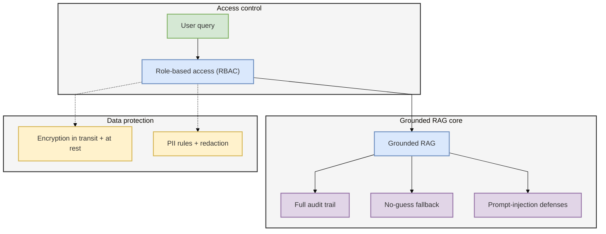

- Role-based access control for source visibility
- Data encryption in transit and at rest
- PII handling rules and redaction where required
- Full auditability of question, retrieval evidence, and final answer
- Strict fallback behavior for uncertain answers (no guessing)
- Prompt-injection resistance via context isolation and policy checks

---

## 10) Reliability and SLOs

Target service levels (initial production):

| Metric | Target |
|--------|--------|
| Availability | **99.9%** |
| P95 response latency | **< 5 seconds** (standard queries) |
| Citation coverage | **≥ 90%** of responses |
| Unsafe-guess rate | **< 5%** |

Reliability controls:

- Request timeout and retry policy
- Graceful degradation (fallback message when dependencies fail)
- Circuit breaker for unstable downstream components
- Health checks and alerting for core services

---

## 11) Performance and Scaling Strategy

```mermaid
%%{init: {'flowchart': {'curve': 'linear', 'padding': 16}, 'theme': 'base'}}%%
flowchart LR
  classDef phaseBox fill:#dae8fc,stroke:#6c8ebf,stroke-width:2px,color:#333

  subgraph P1 ["Phase 1 — local"]
    direction TB
    B1["Single backend"]
    V1["Local vector DB"]
    I1["Scheduled batch ingest"]
  end

  subgraph P2 ["Phase 2 — pilot"]
    direction TB
    B2["Managed vector store"]
    A2["API autoscaling"]
    C2["Query cache"]
    S2["Split ingest vs serve"]
  end

  subgraph P3 ["Phase 3 — production"]
    direction TB
    B3["Stateless API fleet"]
    M3["Managed model routing"]
    R3["Dedicated rerank + eval"]
    D3["Regional DR"]
  end

  P1 ==> P2 ==> P3

  class B1,V1,I1,B2,A2,C2,S2,B3,M3,R3,D3 phaseBox
  style P1 fill:#f5f5f5,stroke:#333,stroke-width:2px
  style P2 fill:#f5f5f5,stroke:#333,stroke-width:2px
  style P3 fill:#f5f5f5,stroke:#333,stroke-width:2px
```

### Phase 1: Local / Small Team

- Single backend instance
- Local vector DB and local model runtime
- Batch ingestion job on schedule

### Phase 2: Pilot / Moderate Load

- Move vector store to managed service
- Introduce API autoscaling
- Add caching for repeated queries
- Separate ingestion and serving workloads

### Phase 3: Production / Multi-Team

- Multi-instance stateless API layer
- Managed model endpoints with routing
- Dedicated reranker and evaluation services
- Regional deployment and disaster recovery strategy

---

## 12) Quality Evaluation Framework

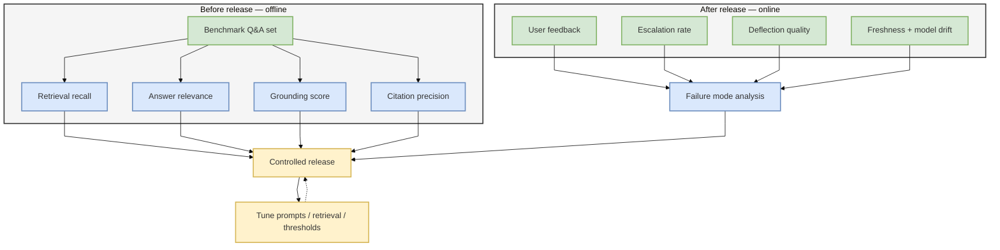

### Offline Evaluation (before release)

- Curated question set from real support queries
- Metrics: retrieval recall, answer relevance, grounding score, citation precision

### Online Evaluation (after release)

- User feedback rate
- Escalation rate by topic
- Deflection quality (resolved vs merely deflected)
- Drift detection for content freshness and model behavior

---

## 13) Rollout Plan

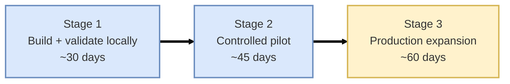

### Stage 1: Build and Validate Locally

- Implement ingestion, retrieval, generation, citations, and fallback
- Run offline eval and tune chunking/retrieval parameters

### Stage 2: Controlled Pilot

- Enable selected teams and monitored traffic
- Compare KPI movement against baseline

### Stage 3: Production Expansion

- Add governance automation, deeper monitoring, and incident playbooks
- Expand sources and team coverage with change control

---

## 14) Open Decisions Checklist

- Final model choice for local and production
- Vector DB choice for cloud production
- Exact confidence threshold policy per domain
- Escalation integration target (ticketing/chat system)
- Data refresh SLA by source type
- Ownership model for knowledge quality and incident response

---

## 15) Final Design Statement

This design creates a practical path from local MVP to production-grade deployment by combining hybrid retrieval, source-grounded generation, confidence-based safety controls, and strong operational visibility. It balances business outcomes (speed, consistency, workload reduction) with technical requirements (reliability, security, and scalability), while remaining understandable to both technical and non-technical stakeholders.

### Design principles (summary)

| Principle | How the system delivers it |
|-----------|----------------------------|
| Grounded answers | Retrieve first, generate from evidence only |
| Trust | Citations on every confident response |
| Safety | Confidence gate + human handoff when unsure |
| Operability | Logs, metrics, traces, and SLOs from day one |
| Evolution | Offline + online evaluation driving controlled tuning |
